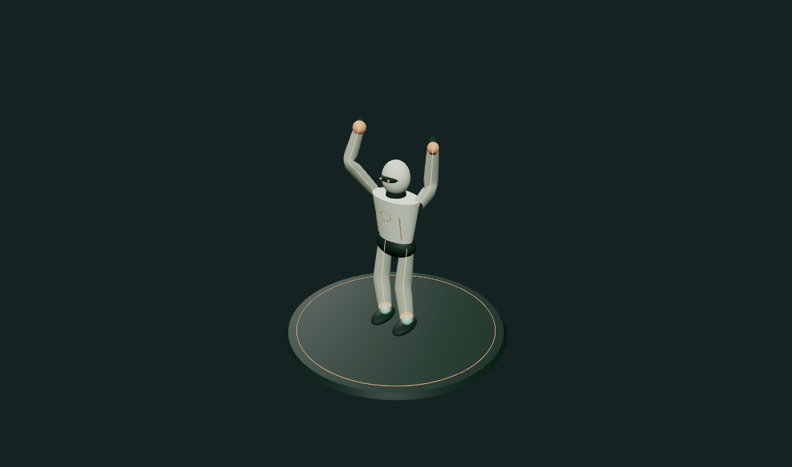
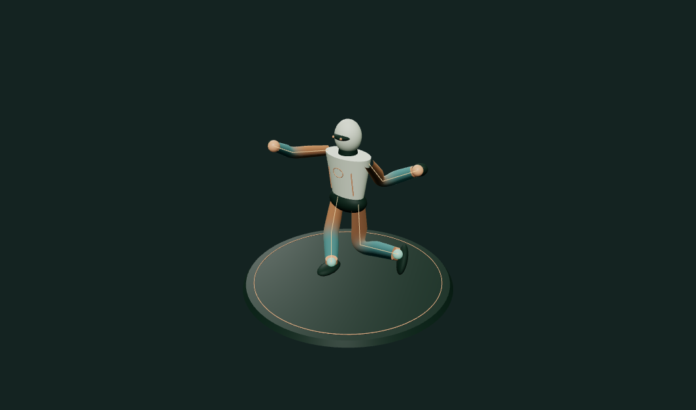

# Rig & Pose Playground

A browser tool for posing a skinned mannequin and building a short keyframe sequence. Hand and foot targets drive four two-bone FABRIK chains. Each limb is a real `SkinnedMesh`: the elbow or knee deforms a weighted vertex surface, while a bone overlay makes the solved chain visible.

## Run

The standalone application uses `@zachshotamartin/graphics-workbench`. Keep its `GraphicsWorkbench` checkout beside this repository when using the local file dependency.

```sh
npm install
npm run dev
npm test
npm run build
```

The portfolio and standalone app import the same `createExperiment(ctx)` from `src/index.js`. No GitHub Actions are included.

## Workflow

1. Drag a colored hand or foot target; drag empty space to orbit. The selected-target menu and three coordinate sliders provide the same adjustment without pointer precision.
2. Choose Ready stance, Vault salute, Balance reach, or Wave. The torso remains fixed, so each target affects its own limb.
3. Enable **Show skin weights**. Warm and cool colors show upper-bone and lower-bone influence. Joint blend width edits the normalized vertex weights, not a visual overlay alone.
4. Scrub the four-second timeline, adjust a target, and save a keyframe. Saving within 0.04 seconds of an existing keyframe replaces it. Delete removes the nearest keyframe, while keeping at least one pose.
5. Play the interpolated loop, undo a saved pose edit, or export/import its JSON sequence. PNG capture is supplied by the shared runtime.

## Implementation

- `src/kinematics.js` contains pure FABRIK, skin-weight and keyframe functions. FABRIK preserves root position and segment lengths. Unreachable targets extend the chain to its reach; they never lengthen a bone. A pole chooses the two-bone bend plane.
- `src/index.js` builds the skinned geometry, skeletons, material-weight inspection and target controls. Skinning uses two weights per vertex with a smooth transition at each joint.
- Keyframes contain world-space endpoint targets, not baked screenshots or prerecorded bone transforms. Playback interpolates targets and solves the limbs again each frame.
- JSON has `{version: 1, duration: 4, blend, keyframes: [{time, targets}]}`. Import validates four limb targets, finite coordinates and a bounded keyframe count.

The approach follows the positional inverse-kinematics method in [Aristidou & Lasenby, FABRIK (2011)](https://www.andreasaristidou.com/FABRIK.html) and uses [Three.js SkinnedMesh](https://threejs.org/docs/#SkinnedMesh) for linear blend skinning.

## Limits and tests

This is a four-limb rig study, not a humanoid animation package. There is no full-body balance solver, torso IK, joint-angle limit system, hand articulation, collision avoidance or dual-quaternion skinning. Tight bends can lose volume. The blend-width control is a smooth weight preset rather than a per-vertex paintbrush.

Tests check reachable and unreachable IK, root and length preservation, pole placement, normalized weights, looping interpolation, input validation and nonmutation. `examples/` contains actual browser viewport captures and reproducible editing steps.

## Run and explore

[Open the portfolio demo](https://zachsm.com/experiments/rig-pose-playground). This repository runs independently and exports the same implementation used by the portfolio.

Requires Node.js 22 or later.

```sh
npm ci
npm test
npm run dev
```

`npm run build` produces a static site in `dist`. Editing, uploaded files, and exports stay in the browser. No account, server processing, or GitHub Actions is required.

## Captured examples



Vault salute · hand targets solved through two-bone IK.



Balance reach · skin weights shown with a 0.43 joint blend width.

Exact reproduction steps are recorded in [the example manifest](examples/manifest.json).
